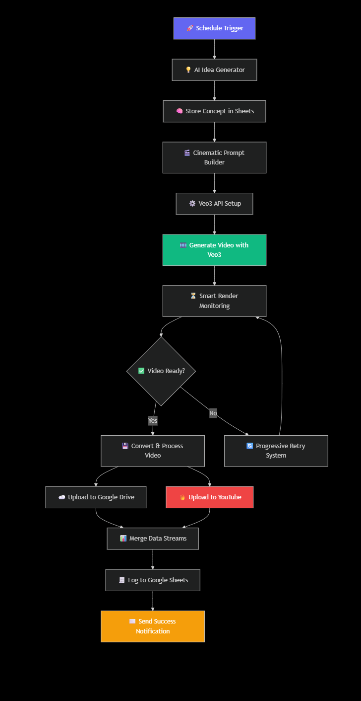

<div align="center">

<!-- Wave Divider -->


<!-- Main Title -->
<h1>🎬 AI Video Factory Automator</h1>

<!-- Subtitle with typing effect -->
<p>
  
</p>

<!-- BADGES -->


</div>


---

## 🚀 Overview

The **AI Video Factory** is a modular, production-ready automation workflow that:
- Generates **AI videos via Veo3** (Google Vertex AI)
- Automatically creates **captions, hashtags, and titles** using Gemini (PaLM)
- Uploads results to **Google Drive**
- Logs metadata in **Google Sheets**
- Publishes to **YouTube** automatically
- Sends Succesfully Created  emails via **Gmail**

---

## 🧩 Key Features

| Feature | Description |
|----------|-------------|
| 🎥 **AI Video Generation** | Generates unique, cinematic videos from text prompts using Google Veo3. |
| 🧠 **AI Caption & Title Builder** | Uses Gemini / PaLM to generate optimized YouTube titles, tags, and hashtags. |
| ☁️ **Drive & Sheet Integration** | Stores videos and logs metadata automatically. |
| 📊 **Smart Wait & Retry Logic** | Adaptive retry mechanism for long-running API operations. |
| 🔐 **Secure Credential System** | Built with environment variables or OAuth2 best practices. |
| 🎬 **Youtube Upload** | Uploads “Video” to a social platform with preview links. |
| 📧 **Email Notifications** | Sends creative “Video Ready” messages with preview links. |

---

## ⚙️ Workflow Architecture

<p align="center">
  
	<br>
  <em>End-to-End Automated Video Production Pipeline</em>
</p>


## 🔧 Core Modules & Nodes

| Module | Purpose | Key Nodes |
|--------|----------|-----------|
| 💡 **Idea Input** | Accepts text prompts or creative ideas. | Google Sheets Trigger / Manual Input |
| 🧠 **Gemini Caption Generator** | Uses Gemini / PaLM to generate titles, captions, and hashtags. | Gemini Text Generation Node |
| 🎬 **Veo3 Video Generation** | Sends requests to Google Vertex AI’s Veo3 model. | HTTP Request Node (POST → Vertex AI Endpoint) |
| ⏳ **Smart Wait & Retry System** | Waits for `operationName` completion from Vertex AI. | Function Node + Wait Node |
| 💾 **Google Drive Upload** | Uploads final MP4 from Veo3 response to Drive. | Google Drive Upload Node |
| 📺 **YouTube Upload** | Publishes approved videos directly to YouTube with metadata. | YouTube Upload Node |
| 📋 **Google Sheets Logger** | Logs metadata: idea, caption, operationName, links, timestamps. | Google Sheets Append Row Node |
| ✉️ **Gmail Notification** | Sends a success email with video preview, title, and review buttons. | Gmail Send Email Node |

---
## 🧭 Credential Setup Guide

Before running the workflow, configure your API credentials securely.  
Use the included [Client Setup Guide](./client_setup_guide/ClientSetupGuide.html) for an interactive step-by-step setup.


| Service | Purpose | Credential Type |
|----------|----------|----------------|
| Google Cloud | Veo3 model & Vertex AI API | Service Account (JSON) |
| YouTube | Video upload | OAuth2 |
| Gemini (PaLM) | Captions & metadata | API Key |
| Drive & Sheets | File storage & logging | OAuth2 |
| Gmail | Notifications | OAuth2 |

> 🧱 All credentials should be created within the n8n Credentials Manager — never hardcode secrets in the workflow.

---
## 🗂 Repository Structure
```
AI-Video-Factory-Veo3/
│
├── 📄 README.md
├── 🧠 AI Video Factory Automator-Veo3.json      # main n8n workflow
├── 📘 Credential_Setup_Wizard.html              # onboarding guide (exported HTML)
├── ⚙️  LICENSE
├── 🧩 assets/
│   ├── demo_screenshot.png
│   ├── architecture_diagram.png
│   └── sample_output_thumbnail.jpg
└── 📁 docs/
    ├── Veo3_API_Setup_Guide.md
    ├── Workflow_Architecture.md
    └── Troubleshooting.md
```
---

## 🔁 Review Flow

 

---

## 🛠️ Installation

1. Clone this repo  
   ```bash
   git clone https://github.com/YOUR-USERNAME/AI-Video-Factory-Veo3.git
   cd AI-Video-Factory-Veo3


---
## 💰 Cost Optimization
 ### 💸 Budget Management Tips
1. Start Small - Test with 1-2 videos daily

2. Monitor Usage - Use Google Cloud cost alerts

3. Optimize Prompts - Reduce render failures

4. Schedule Wisely - Align with content calendar

### 📈 Estimated Costs
| Service | Cost per Video | Monthly (100 videos) |
|----------|----------|----------------|
| Veo3 API | ~$0.20 | $20.00 |
| Gemini API | ~$0.01 | $1.00 |
| Storage | ~$0.05 | $5.00 |
| Total | ~$0.26 | $26.00 |
	

---

## 📜 License

This project is licensed under the **MIT License** - see the [LICENSE](LICENSE) file for complete details.

**MIT License © 2025 Dinesh Barri**

---

## ⭐ Feedback & Contributions

Have ideas or want to collaborate?
Open a pull request or reach out via Issues — let’s shape the future of AI-powered video automation together.
