<div align="center">

<!-- Wave Divider -->


<!-- Main Title -->
<h1>🎬 AI Video Factory Automator</h1>

<!-- Subtitle with typing effect -->
<p>
  
</p>

<!-- BADGES -->


</div>

---
## 🚀 Overview

The **AI Video Factory** is a modular, production-ready automation workflow that:
- Generates **AI videos via Veo3** (Google Vertex AI)
- Automatically creates **captions, hashtags, and titles** using Gemini (PaLM)
- Uploads results to **Google Drive**
- Logs metadata in **Google Sheets**
- Publishes to **YouTube** automatically
- Sends Succesfully Created  emails via **Gmail**

---

## 🧩 Key Features

| Feature | Description |
|----------|-------------|
| 🎥 **AI Video Generation** | Generates unique, cinematic videos from text prompts using Google Veo3. |
| 🧠 **AI Caption & Title Builder** | Uses Gemini / PaLM to generate optimized YouTube titles, tags, and hashtags. |
| ☁️ **Drive & Sheet Integration** | Stores videos and logs metadata automatically. |
| 📊 **Smart Wait & Retry Logic** | Adaptive retry mechanism for long-running API operations. |
| 🔐 **Secure Credential System** | Built with environment variables or OAuth2 best practices. |
| 🎬 **Youtube Upload** | Uploads “Video” to a social platform with preview links. |
| 📧 **Email Notifications** | Sends creative “Video Ready” messages with preview links. |

---

<div align = "center">
	
## ⚙️ Workflow Architecture

<p align="center">
  
	<br>
  <em>End-to-End Automated Video Production Pipeline</em>
</p>

</div>

---


<div align="center">

##  🖼️ Workflow Demo


*Complete n8n workflow showing the end-to-end automation pipeline*
</div>

**🧭 Workflow Path:**
Schedule Trigger → Idea Generator → Gemini → Veo3 API → Drive → YouTube → Sheets → Gmail


---

<div align="center">

### 1. Idea Generation Pipeline

<br>
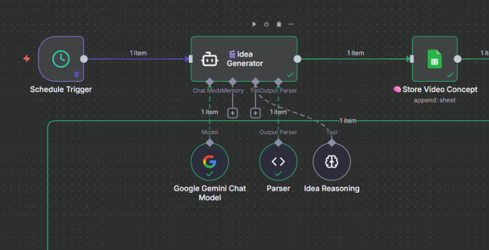
<br> AI-powered creative concept generation


#### **↓ Output ↓**

<br>

<br> Structured Data in Google Sheets
</div>


**Generated Fields:**
- **Caption**: Viral-ready title with emoji and hashtags
- **Idea**: Concise concept under 13 words
- **Environment**: Visual setting description
- **Status**: "for production" flag


<div align="center" >

### 2. 🎬 Veo3 Video Generation Core

<!-- MAIN FLOW DIAGRAM -->
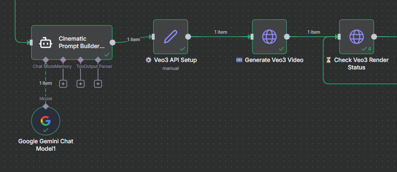
<p style="font-size:14px;color:#6B7280;margin-top:5px;">
🧩 Connected workflow — <em>Cinematic Prompt Builder → Veo3 API Setup → Generate Veo3 Video → Render Status Check</em>
</p>

---

### ⚙️ Output 1 — Prompt Generation & API Setup

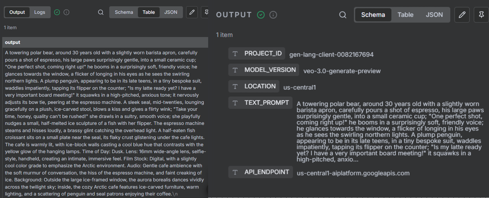

<p align="center" style="font-size:14px;color:#4B5563;">
🧠 <strong>Cinematic Prompt Builder</strong> crafts rich, story-driven prompts.<br>
⚙️ <strong>API Setup</strong> defines <code>project_id</code>, <code>region</code>, and <code>endpoint</code> — preparing Veo3 for the magic.
</p>

### ⚡ Output 2 — Video Generation & Render Status

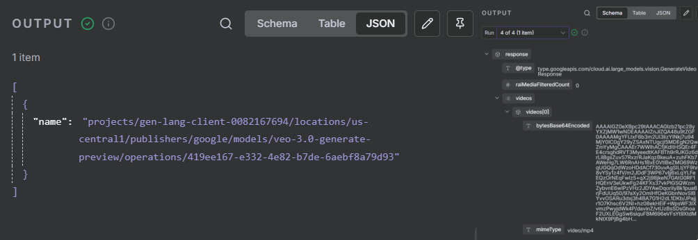

<p align="center" style="font-size:14px;color:#4B5563;">
🎬 <strong>Generate Veo3 Video</strong> submits your cinematic prompt to Vertex AI.<br>
⏳ <strong>Render Status Check</strong> tracks progress until your AI video is fully generated.
</p>

---
<p style="font-size:13px;color:#6B7280;">
💡 <em>This two-step visualization clearly shows the transition from creative AI prompt → API configuration → real-time video generation and render completion.</em>
</p>

</div>

---

<div align="center">

### 3. 🔁 Smart Retry System & Failure Handling

<p style="font-size:16px;color:#374151;">
Resilient automation built to recover from API delays and failures — ensuring every Veo3 render completes or gracefully notifies you.
</p>

<!-- MAIN FLOW IMAGE -->
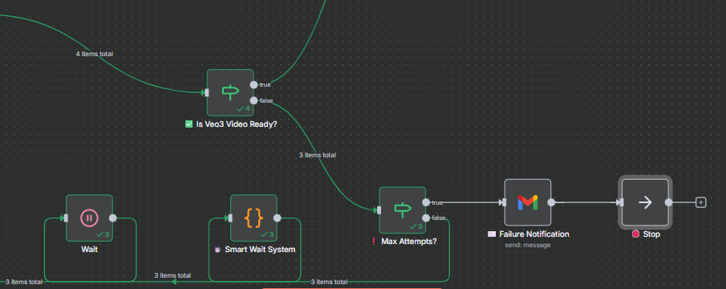
<p style="font-size:14px;color:#6B7280;margin-top:5px;">
🧩 Workflow Segment — <em>Max Retry Counter → Wait Node → Veo3 Status Check → Failure Email</em>
</p>


### ⏳ Output 1 — Retry Logic in Action

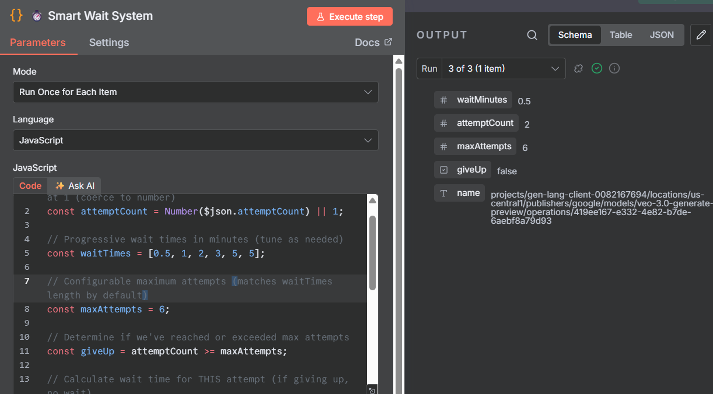

<p align="center" style="font-size:14px;color:#4B5563;">
🔄 <strong>Retry Counter</strong> tracks the number of render attempts.<br>
⏱️ <strong>Wait Node</strong> introduces smart intervals (e.g., 30s → 60s → 120s).<br>
🧠 This adaptive delay ensures Veo3 has enough time to process large video jobs.
</p>

### 📧 Output 2 — Failure Notification Alert

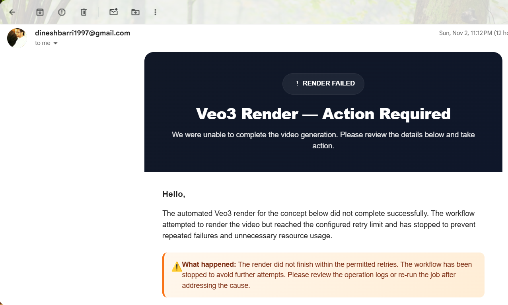

<p align="center" style="font-size:14px;color:#4B5563;">
🚨 After <strong>Max Retries</strong> are reached, the workflow triggers a <strong>Failure Email Notification</strong>.<br>
📩 The message includes <em>Idea Name, Operation ID, Retry Count, and Timestamp</em> — making debugging effortless.
</p>

</div>

---


<div align="center">

## ⚖️ Success vs Failure Flow

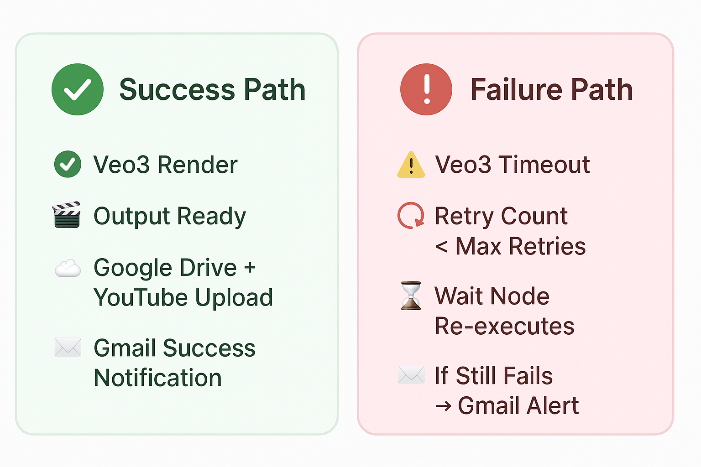

<p style="font-size:14px;color:#4B5563;max-width:600px;margin:0 auto;">
This visual clearly differentiates the two possible outcomes of the <strong>Smart Retry System</strong>.<br>
🟢 <strong>Success Path</strong> — smooth render completion, uploads, and success notifications.<br>
🔴 <strong>Failure Path</strong> — intelligent retries followed by a Gmail alert if the job fails.
</p>

</div>

---


<div align="center">

### 4. ☁️ File Processing & Upload

<p style="font-size:16px;color:#374151;">
From AI-rendered data to published content — this segment converts, uploads, and organizes your video files seamlessly across Google services.
</p>

<!-- MAIN FLOW IMAGE -->
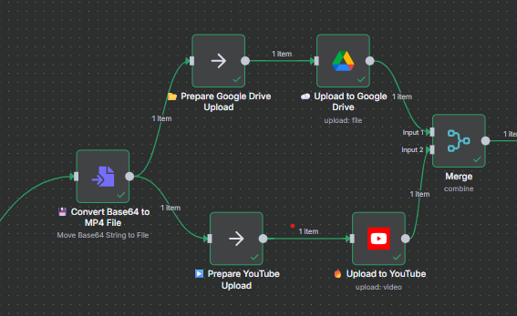
<p style="font-size:14px;color:#6B7280;margin-top:5px;">
🧩 Workflow Segment — <em>Base64 → MP4 Conversion → Drive Upload → YouTube Upload → Data Merge for Logging</em>
</p>

--- 

### 🎞️ Output 1 — Base64 to MP4 Conversion

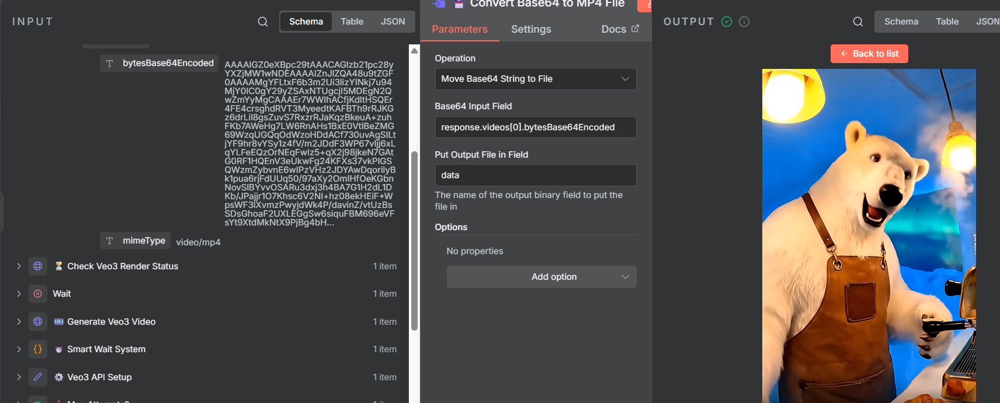

<p align="center" style="font-size:14px;color:#4B5563;">
💾 The <strong>Base64 → MP4 Converter</strong> node decodes raw Veo3 output into a playable video file.<br>
🧱 Prepares the final media for parallel uploads and metadata handling.
</p>

---

### ☁️ Output 2 — Google Drive Upload

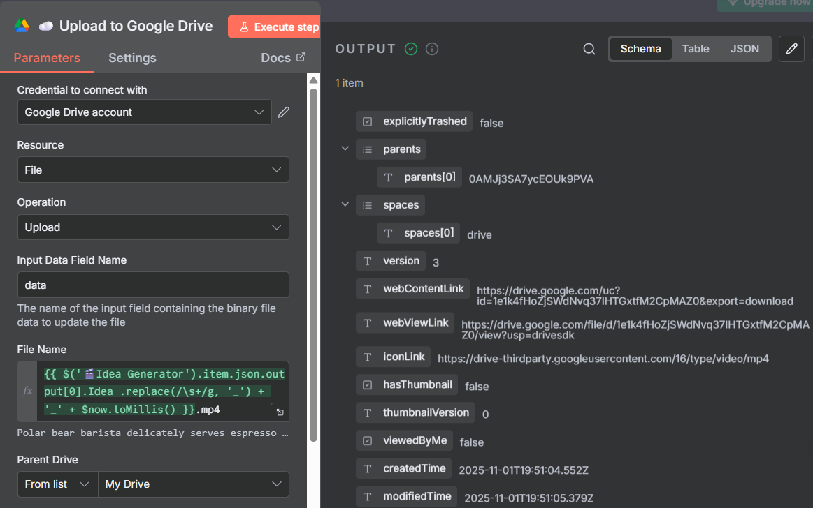

<p align="center" style="font-size:14px;color:#4B5563;">
📂 The <strong>Google Drive Upload</strong> node stores the generated MP4 in your designated Drive folder.<br>
✅ Automatically assigns file names with timestamps and project tags.
</p>

---

### 📺 Output 3 — YouTube Upload with Metadata

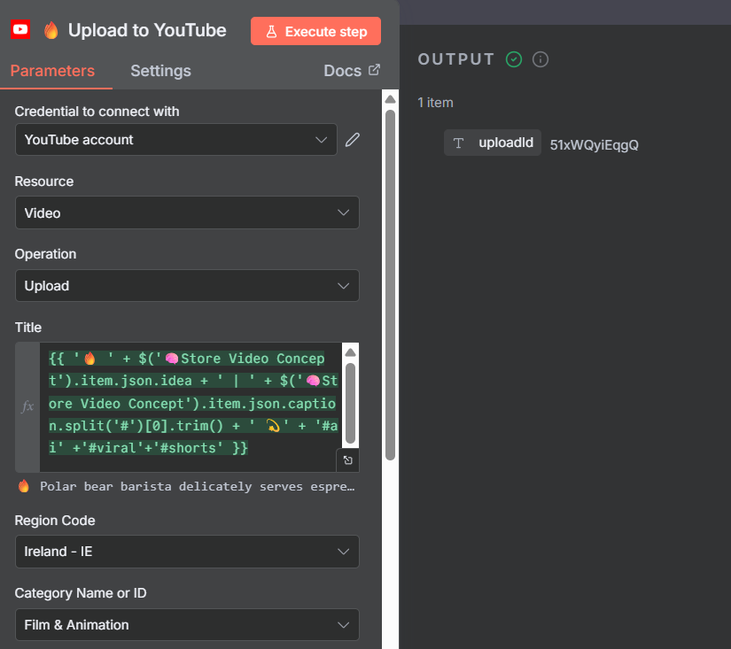

<p align="center" style="font-size:14px;color:#4B5563;">
🎬 The <strong>YouTube Upload</strong> node publishes videos directly with AI-generated <em>title, description, hashtags, and thumbnail</em>.<br>
🚀 End-to-end automated publishing in one click.
</p>
	
</div>

---


<div align="center" >

### 5. 🧾 Data Logging & Success Notification

<p style="font-size:16px;color:#374151;">
Every successful video is logged, tracked, and celebrated — with automated data entry and a personalized success email.
</p>

<!-- MAIN FLOW IMAGE -->
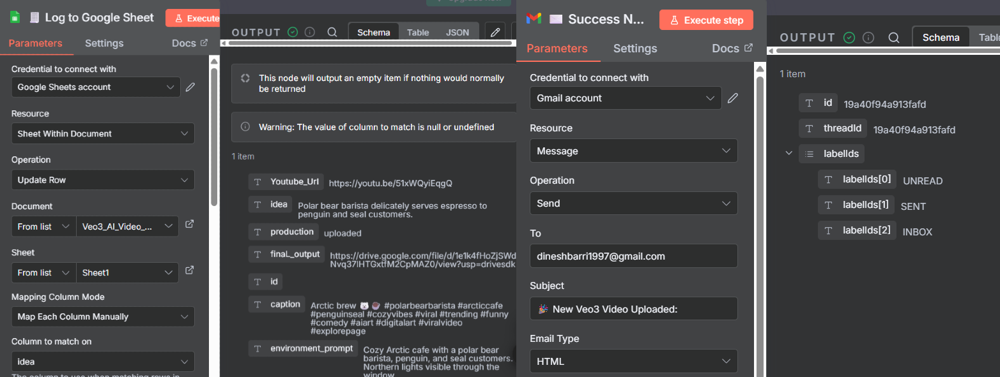
<p style="font-size:14px;color:#6B7280;margin-top:5px;">
🧩 <em>Data Merge → Google Sheets Log → Gmail Success Notification</em>
</p>
</div>

---

## 🎥 Output — YouTube Upload & Gmail Success 

<table align="center" style="width:100%; border-collapse:collapse;">
<tr>

<!-- LEFT GIF: Gmail Notification -->
<td style="width:50%; text-align:center; vertical-align:top; padding:10px;">
<h3 style="color:#C084FC;">✉️ Gmail Success Notification</h3>
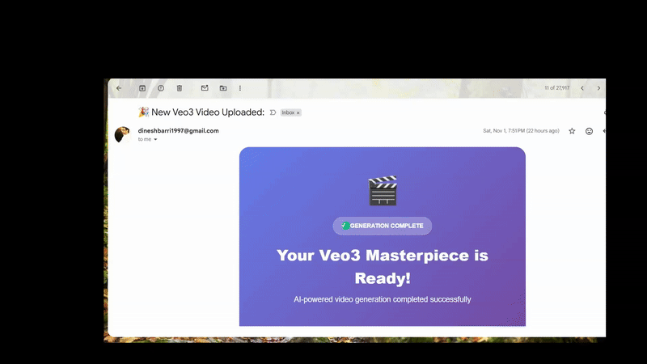
<p style="font-size:13px; color:#6B7280; margin-top:6px;">
Automated success email with video details and preview links.
</p>
</td>

<!-- RIGHT GIF: YouTube Upload -->
<td style="width:50%; text-align:center; vertical-align:top; padding:10px;">
<h3 style="color:#EF4444;">📺 YouTube Upload</h3>
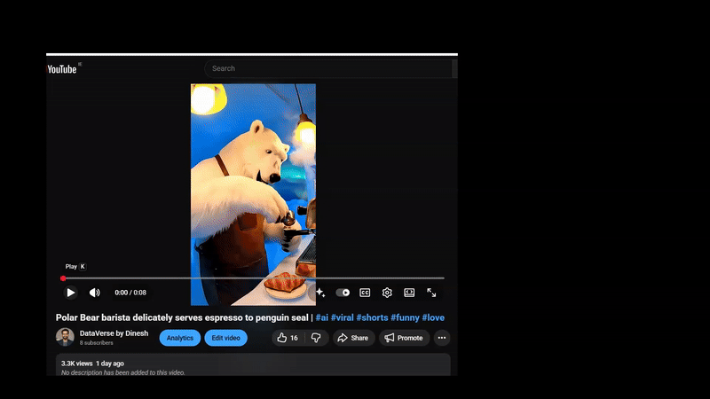
<p style="font-size:13px; color:#6B7280; margin-top:6px;">
Seamless AI-to-YouTube upload — fully automated with title, caption, and tags.
</p>
</td>

</tr>
</table>

</div>

---

## 🔧 Core Modules & Nodes

| Module | Purpose | Key Nodes |
|--------|----------|-----------|
| 💡 **Idea Input** | Accepts text prompts or creative ideas. | Google Sheets Trigger / Manual Input |
| 🧠 **Gemini Caption Generator** | Uses Gemini / PaLM to generate titles, captions, and hashtags. | Gemini Text Generation Node |
| 🎬 **Veo3 Video Generation** | Sends requests to Google Vertex AI’s Veo3 model. | HTTP Request Node (POST → Vertex AI Endpoint) |
| ⏳ **Smart Wait & Retry System** | Waits for `operationName` completion from Vertex AI. | Function Node + Wait Node |
| 💾 **Google Drive Upload** | Uploads final MP4 from Veo3 response to Drive. | Google Drive Upload Node |
| 📺 **YouTube Upload** | Publishes approved videos directly to YouTube with metadata. | YouTube Upload Node |
| 📋 **Google Sheets Logger** | Logs metadata: idea, caption, operationName, links, timestamps. | Google Sheets Append Row Node |
| ✉️ **Gmail Notification** | Sends a success email with video preview, title, and review buttons. | Gmail Send Email Node |

---

## 🧩 Client Setup Guide

- ***Before running the workflow, configure your API credentials securely.***

- **Use the interactive  Client Setup Guide 🌐  to walk through the step-by-step onboarding process and securely link your API credentials with n8n.**

<p align="center">
  <a href="https://unrivaled-chaja-4615f0.netlify.app/" target="_blank" rel="noopener noreferrer">
    
  </a>
</p>

> 🧱 All credentials should be created within the n8n Credentials Manager — never hardcode secrets in the workflow.

---
## 🗂 Repository Structure
```
AI-Video-Factory-Veo3/
│
├── 📄 README.md
├── 🧠 AI Video Factory Automator-Veo3.json # main n8n workflow
├── ⚙️ LICENSE
├── 🧩 assets/
│ ├── workflow-overview.png
│ ├── execution-demo.png
│ ├── veo3-generation.png
│ ├── youtube-publishing.png
│ ├── email-notification.png
│ └── video_creation_pipeline.png
└── 📁 docs/
├── client_setup_guide.html
├── package.json
└── Troubleshooting.md
```


## 🛠️ Installation

Follow these steps to set up and run the **AI Video Factory — Veo3 Automation Pipeline** on your system:

### 1️⃣ Clone the Repository
- Clone the repository to your local environment and navigate into the project folder.

``` 
    git clone https://github.com/dineshbarri/AI-Video-Factory-Veo3-Automation-Pipeline.git
    cd AI-Video-Factory-Veo3-Automation-Pipeline
```
###  2️⃣ Import the Workflow into n8n

-  Open your n8n instance (Cloud or Local).  
-  Click **Import Workflow → Upload JSON**, and select the file:  
   **`AI Video Factory Automator-Veo3.json`**
  -  Once imported, the workflow nodes and credentials structure will load automatically into your n8n dashboard.
### 3️⃣ Configure Credentials


<p align="center"> <a href="https://unrivaled-chaja-4615f0.netlify.app/" target="_blank" rel="noopener noreferrer">  </a> </p>

### 4️⃣ Test & Verify
```
✅ All credentials connected
✅ Google Sheets logging active  
✅ Drive uploads working
✅ YouTube publishing live
✅ Email notifications sending
```
---
## 💰 Cost Optimization

### 🎯 Performance Metrics
- ⚡ Generation Time: 2-5 minutes per video
- ✅ Success Rate: 95%+ with smart retry logic
- 📊 Monthly Capacity: 500+ videos
- 🔄 Retry Attempts: 0-2 average with progressive backoff
- 📱 Output Quality: 9:16 HD mobile-optimized format

### 📈 Estimated Costs
| Service | Cost per Video | Monthly (100 videos) |
|----------|----------|----------------|
| Veo3 API | ~$0.20 | $20.00 |
| Gemini API | ~$0.01 | $1.00 |
| Storage | ~$0.05 | $5.00 |
| Total | ~$0.26 | $26.00 |

---
## 📞 Need Help?
###  [](https://github.com/dineshbarri/AI-Video-Factory-Veo3-Automation-Pipeline/issues/new/choose)
---

## 📜 License
This project is licensed under the **MIT License** - see the [LICENSE](LICENSE) file for complete details.

**MIT License © 2025 Dinesh Barri**
 
---
## 👤 Author

 #### &nbsp; Dinesh Barri

-  [](https://github.com/dineshbarri)
-  [](https://www.linkedin.com/in/dinesh-barri-7654b010b)
---

## ⭐ Feedback & Contributions
- 🐛 Report Bugs - Create detailed issue reports
- 💡 Suggest Features - Share your ideas for improvement
- 🔧 Submit PRs - Code improvements and new features
- 📚 Improve Docs - Better documentation and examples


