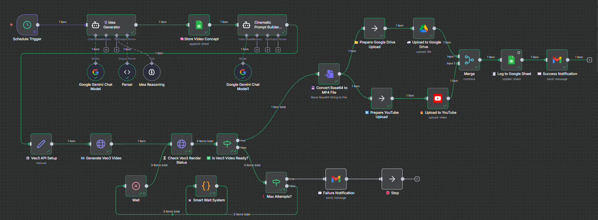
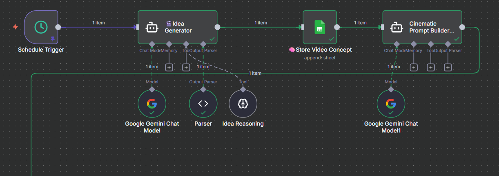
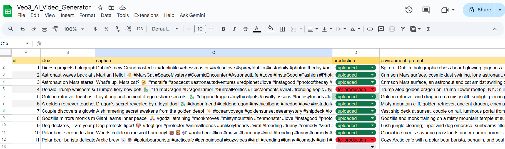

<div align="center">

<!-- Wave Divider -->


<!-- Main Title -->
<h1>🎬 AI Video Factory Automator</h1>

<!-- Subtitle with typing effect -->
<p>
  
</p>

<!-- BADGES -->


</div>

---
## 🚀 Overview

The **AI Video Factory** is a modular, production-ready automation workflow that:
- Generates **AI videos via Veo3** (Google Vertex AI)
- Automatically creates **captions, hashtags, and titles** using Gemini (PaLM)
- Uploads results to **Google Drive**
- Logs metadata in **Google Sheets**
- Publishes to **YouTube** automatically
- Sends Succesfully Created  emails via **Gmail**

---

## 🧩 Key Features

| Feature | Description |
|----------|-------------|
| 🎥 **AI Video Generation** | Generates unique, cinematic videos from text prompts using Google Veo3. |
| 🧠 **AI Caption & Title Builder** | Uses Gemini / PaLM to generate optimized YouTube titles, tags, and hashtags. |
| ☁️ **Drive & Sheet Integration** | Stores videos and logs metadata automatically. |
| 📊 **Smart Wait & Retry Logic** | Adaptive retry mechanism for long-running API operations. |
| 🔐 **Secure Credential System** | Built with environment variables or OAuth2 best practices. |
| 🎬 **Youtube Upload** | Uploads “Video” to a social platform with preview links. |
| 📧 **Email Notifications** | Sends creative “Video Ready” messages with preview links. |

---
## ⚙️ Workflow Architecture

<p align="center">
  
	<br>
  <em>End-to-End Automated Video Production Pipeline</em>
</p>

---
##  🖼️ Workflow Demo


<div align="center">

<div style="display: flex; flex-direction: column; gap: 30px; align-items: center;">

<!-- Workflow Overview -->
<div style="border: 1px solid #e1e4e8; border-radius: 12px; padding: 20px; box-shadow: 0 4px 12px rgba(0,0,0,0.1); background: white; max-width: 850px;">
    
    <div style="text-align: center; margin-top: 15px;">
        <h3 style="color: #2c3e50; margin-bottom: 8px;"> </h3>
        <p style="color: #666; line-height: 1.5;">Complete n8n workflow showing the entire AI video generation pipeline from idea creation to multi-platform publishing</p>
    </div>
</div>

<div style="display:flex; flex-wrap:wrap; justify-content:center; align-items:flex-start; gap:24px; margin:30px auto; max-width:1100px;">

  <!-- Left: Workflow View -->
  <div style="flex:1; min-width:420px; text-align:center; background:#f9fafb; border:1px solid #e5e7eb; border-radius:12px; box-shadow:0 4px 12px rgba(0,0,0,0.08); padding:14px;">
    <h3 style="color:#4f46e5; margin-top:0;">🎬 Active n8n Workflow Execution</h3>
    
    <p style="font-size:14px; color:#6b7280; margin-top:10px;">
      Real-time execution in <strong>n8n</strong> — showing the <em>Idea Generator</em>, <em>Gemini Model</em>, and <em>Prompt Builder</em> nodes producing a creative prompt ready for Veo3 generation.
    </p>
  </div>

  <!-- Right: Google Sheets Log -->
  <div style="flex:1; min-width:420px; text-align:center; background:#ffffff; border:1px solid #e5e7eb; border-radius:12px; box-shadow:0 4px 12px rgba(0,0,0,0.08); padding:14px;">
    <h3 style="color:#10b981; margin-top:0;">📊 Logged Output in Google Sheets</h3>
    
    <p style="font-size:14px; color:#6b7280; margin-top:10px;">
      The output of executed nodes is logged automatically in <strong>Google Sheets</strong>.<br>
      Rows marked <span style="color:#dc2626; font-weight:600;">for production</span> indicate videos ready for Veo3 rendering and YouTube publishing.
    </p>
  </div>

</div>

<!-- Veo3 Generation -->
<div style="border: 1px solid #e1e4e8; border-radius: 12px; padding: 20px; box-shadow: 0 4px 12px rgba(0,0,0,0.1); background: white; max-width: 850px;">
    
    <div style="text-align: center; margin-top: 15px;">
        <h3 style="color: #2c3e50; margin-bottom: 8px;">🎬 Google Veo3 AI Video Production</h3>
        <p style="color: #666; line-height: 1.5;">AI-powered video generation using Google's Veo3 model, showing prompt processing and video creation workflow</p>
    </div>
</div>

<!-- YouTube Publishing -->
<div style="border: 1px solid #e1e4e8; border-radius: 12px; padding: 20px; box-shadow: 0 4px 12px rgba(0,0,0,0.1); background: white; max-width: 850px;">
    
    <div style="text-align: center; margin-top: 15px;">
        <h3 style="color: #2c3e50; margin-bottom: 8px;">📺 Automated YouTube & Drive Publishing</h3>
        <p style="color: #666; line-height: 1.5;">Seamless multi-platform publishing to YouTube and Google Drive with automated metadata and description generation</p>
    </div>
</div>

<!-- Email Notification -->
<div style="border: 1px solid #e1e4e8; border-radius: 12px; padding: 20px; box-shadow: 0 4px 12px rgba(0,0,0,0.1); background: white; max-width: 850px;">
    
    <div style="text-align: center; margin-top: 15px;">
        <h3 style="color: #2c3e50; margin-bottom: 8px;">✉️ Automated Success Notifications</h3>
        <p style="color: #666; line-height: 1.5;">Professional email notifications sent upon workflow completion with video details and platform links</p>
    </div>
</div>

</div>

<br>

<div style="background: linear-gradient(135deg, #667eea 0%, #764ba2 100%); padding: 30px; border-radius: 12px; color: white; text-align: center; max-width: 850px;">
    <h2 style="margin-bottom: 15px;">🚀 Ready to Automate Your Video Production?</h2>
    <p style="margin-bottom: 20px; opacity: 0.9;">This workflow demonstrates complete AI-powered video creation from concept to distribution</p>
    <div style="display: flex; gap: 15px; justify-content: center; flex-wrap: wrap;">
        <a href="#installation" style="background: white; color: #667eea; padding: 12px 24px; border-radius: 6px; text-decoration: none; font-weight: 600; transition: transform 0.2s;">Get Started</a>
        <a href="#usage" style="background: transparent; color: white; padding: 12px 24px; border-radius: 6px; text-decoration: none; font-weight: 600; border: 2px solid white; transition: transform 0.2s;">View Documentation</a>
    </div>
</div>

</div>


---

## 🔧 Core Modules & Nodes

| Module | Purpose | Key Nodes |
|--------|----------|-----------|
| 💡 **Idea Input** | Accepts text prompts or creative ideas. | Google Sheets Trigger / Manual Input |
| 🧠 **Gemini Caption Generator** | Uses Gemini / PaLM to generate titles, captions, and hashtags. | Gemini Text Generation Node |
| 🎬 **Veo3 Video Generation** | Sends requests to Google Vertex AI’s Veo3 model. | HTTP Request Node (POST → Vertex AI Endpoint) |
| ⏳ **Smart Wait & Retry System** | Waits for `operationName` completion from Vertex AI. | Function Node + Wait Node |
| 💾 **Google Drive Upload** | Uploads final MP4 from Veo3 response to Drive. | Google Drive Upload Node |
| 📺 **YouTube Upload** | Publishes approved videos directly to YouTube with metadata. | YouTube Upload Node |
| 📋 **Google Sheets Logger** | Logs metadata: idea, caption, operationName, links, timestamps. | Google Sheets Append Row Node |
| ✉️ **Gmail Notification** | Sends a success email with video preview, title, and review buttons. | Gmail Send Email Node |

---

## 🧩 Client Setup Guide

- ***Before running the workflow, configure your API credentials securely.***

- **Use the interactive  Client Setup Guide 🌐  to walk through the step-by-step onboarding process and securely link your API credentials with n8n.**

<p align="center">
  <a href="https://unrivaled-chaja-4615f0.netlify.app/" target="_blank" rel="noopener noreferrer">
    
  </a>
</p>

> 🧱 All credentials should be created within the n8n Credentials Manager — never hardcode secrets in the workflow.

---
## 🗂 Repository Structure
```
AI-Video-Factory-Veo3/
│
├── 📄 README.md
├── 🧠 AI Video Factory Automator-Veo3.json # main n8n workflow
├── ⚙️ LICENSE
├── 🧩 assets/
│ ├── workflow-overview.png
│ ├── execution-demo.png
│ ├── veo3-generation.png
│ ├── youtube-publishing.png
│ ├── email-notification.png
│ └── video_creation_pipeline.png
└── 📁 docs/
├── client_setup_guide.html
├── package.json
└── Troubleshooting.md
```


## 🛠️ Installation

Follow these steps to set up and run the **AI Video Factory — Veo3 Automation Pipeline** on your system:

### 1️⃣ Clone the Repository
- Clone the repository to your local environment and navigate into the project folder.

``` 
    git clone https://github.com/dineshbarri/AI-Video-Factory-Veo3-Automation-Pipeline.git
    cd AI-Video-Factory-Veo3-Automation-Pipeline
```
###  2️⃣ Import the Workflow into n8n

-  Open your n8n instance (Cloud or Local).  
-  Click **Import Workflow → Upload JSON**, and select the file:  
   **`AI Video Factory Automator-Veo3.json`**
  -  Once imported, the workflow nodes and credentials structure will load automatically into your n8n dashboard.
### 3️⃣ Configure Credentials


<p align="center"> <a href="https://unrivaled-chaja-4615f0.netlify.app/" target="_blank" rel="noopener noreferrer">  </a> </p>

### 4️⃣ Test & Verify
```
✅ All credentials connected
✅ Google Sheets logging active  
✅ Drive uploads working
✅ YouTube publishing live
✅ Email notifications sending
```
---
## 💰 Cost Optimization

### 🎯 Performance Metrics
- ⚡ Generation Time: 2-5 minutes per video
- ✅ Success Rate: 95%+ with smart retry logic
- 📊 Monthly Capacity: 500+ videos
- 🔄 Retry Attempts: 0-2 average with progressive backoff
- 📱 Output Quality: 9:16 HD mobile-optimized format

### 📈 Estimated Costs
| Service | Cost per Video | Monthly (100 videos) |
|----------|----------|----------------|
| Veo3 API | ~$0.20 | $20.00 |
| Gemini API | ~$0.01 | $1.00 |
| Storage | ~$0.05 | $5.00 |
| Total | ~$0.26 | $26.00 |

---
## 📞 Need Help?
###  [](https://github.com/dineshbarri/AI-Video-Factory-Veo3-Automation-Pipeline/issues/new/choose)
---

## 📜 License
This project is licensed under the **MIT License** - see the [LICENSE](LICENSE) file for complete details.

**MIT License © 2025 Dinesh Barri**
 
---
## 👤 Author

 #### &nbsp; Dinesh Barri

-  [](https://github.com/dineshbarri)
-  [](https://www.linkedin.com/in/dinesh-barri-7654b010b)
---

## ⭐ Feedback & Contributions
- 🐛 Report Bugs - Create detailed issue reports
- 💡 Suggest Features - Share your ideas for improvement
- 🔧 Submit PRs - Code improvements and new features
- 📚 Improve Docs - Better documentation and examples


