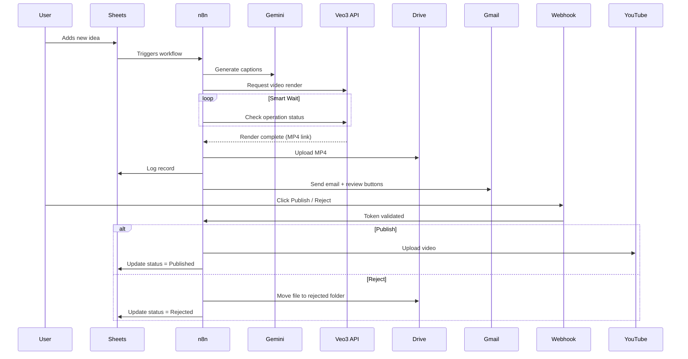

# 🧠 AI Video Factory — Workflow Architecture

> This document explains the full architecture, node relationships, and data flow for the **AI Video Factory (Veo3)** n8n workflow.

---

## 🎯 Objective

To fully automate the **AI video generation and publishing pipeline**, using **Google Vertex AI (Veo3)** as the core generator and **n8n** as the orchestration layer — covering idea input, video creation, asset management, metadata generation, and publication.

---

## 🏗️ High-Level Architecture

```mermaid
graph TD
A[Idea Source (Google Sheet / API Input)] --> B[Gemini Caption Generator]
B --> C[Veo3 Video Generation (Vertex AI API)]
C --> D[Smart Wait / Polling System]
D --> E[Drive Upload + Metadata Extraction]
E --> F[Google Sheets Log Entry]
F --> G[Gmail Notification (Success / Review Email)]
G --> H[Hold-for-Review Webhook]
H --> I[YouTube Publish Automation]
```

---

## 🔧 Core Modules & Nodes

| Module | Purpose | Key Nodes |
|--------|----------|-----------|
| 💡 **Idea Input** | Accepts text prompts or creative ideas. | Google Sheets Trigger / Manual Input |
| 🧠 **Gemini Caption Generator** | Uses Gemini / PaLM to generate titles, captions, and hashtags. | Gemini Text Generation Node |
| 🎬 **Veo3 Video Generation** | Sends requests to Google Vertex AI’s Veo3 model. | HTTP Request Node (POST → Vertex AI Endpoint) |
| ⏳ **Smart Wait & Retry System** | Waits for `operationName` completion from Vertex AI. | Function Node + Wait Node |
| 💾 **Google Drive Upload** | Uploads final MP4 from Veo3 response to Drive. | Google Drive Upload Node |
| 📋 **Google Sheets Logger** | Logs metadata: idea, caption, operationName, links, timestamps. | Google Sheets Append Row Node |
| ✉️ **Gmail Notification** | Sends a success email with video preview, title, and review buttons. | Gmail Send Email Node |
| 🕹️ **Hold-for-Review Webhook** | Waits for approval or rejection click from email. | Webhook Node + Conditional Routing |
| 📺 **YouTube Upload** | Publishes approved videos directly to YouTube with metadata. | YouTube Upload Node |

---

## 🔄 Data Flow Summary

1. **Input Stage**
   - User adds a new idea row in Google Sheets or triggers workflow manually.
   - Metadata: `idea`, `environment_prompt`, `caption`, `production_type`.

2. **Content Generation**
   - Gemini node generates captions, hashtags, and tags based on the idea.
   - Data is validated and formatted before passing to Veo3 API.

3. **Video Rendering**
   - `HTTP Request` node sends structured JSON to Vertex AI’s Veo3 endpoint.
   - Response contains `operationName` for long-running job.

4. **Smart Wait Handling**
   - Function node monitors Veo3 operation status.
   - Implements adaptive retry (`0.5, 1, 2, 3, 5, 5 minutes`).
   - Stops after max attempts if still incomplete.

5. **Drive Upload & Metadata**
   - Final MP4 binary is uploaded to Drive.
   - File name: `{{Idea}}_{{$now.toMillis()}}.mp4`
   - Public or restricted link generated.

6. **Logging & Notification**
   - Metadata logged into Google Sheets (including operation ID & Drive link).
   - Gmail node sends branded HTML notification email with preview.

7. **Hold-for-Review Phase**
   - Email contains “✅ Publish” and “❌ Reject” links (Webhook-based).
   - Clicking triggers n8n Webhook → token validation → routing logic.

8. **Publish / Reject Branch**
   - Publish: Downloads from Drive → Uploads to YouTube → Updates sheet.
   - Reject: Moves to `/rejected` folder → Logs rejection reason.

---

## 🔐 Credential Dependencies

| Service | Scope / Role | Notes |
|----------|--------------|-------|
| Google Cloud (Veo3) | `Vertex AI User`, `Storage Object Admin` | JSON service account key required |
| Google Drive / Sheets | OAuth2 | Scopes: `drive.file`, `spreadsheets` |
| Gmail | OAuth2 | For sending notifications |
| YouTube | OAuth2 | Upload videos |
| Gemini | API Key | Text generation only |

---

## 🧩 Data Schema (Google Sheets)

| Column | Description |
|--------|--------------|
| `Idea` | User’s creative input |
| `Caption` | Gemini-generated caption |
| `Hashtags` | Extracted from caption |
| `Veo3_OperationName` | Returned from Veo3 |
| `Status` | Pending / Completed / Failed / Published / Rejected |
| `Drive_File_ID` | Uploaded MP4 file ID |
| `YouTube_URL` | Published video link |
| `ReviewToken` | Secure token for webhook |
| `Created_At` | Timestamp |

---

## 🧱 Fail-Safe & Resilience

- **Smart Wait**: ensures long renders do not cause workflow crashes.  
- **Retryable HTTP Calls**: all API calls include exponential backoff.  
- **Audit Trail**: all actions are logged into Sheets for traceability.  
- **Review Gate**: prevents auto-publishing without approval.  

---

## 📊 Suggested Enhancements

- Add **Analytics Collector** (YouTube stats → Sheets)
- Add **Auto Thumbnail Generation** (Gemini prompt)
- Add **Content Policy Check** before rendering
- Enable **Multi-language captions**
- Add **Webhook authentication token expiration** (7 days)

---

## 🧭 Diagram — Process Lifecycle



---

## 🧠 Summary

The **AI Video Factory Workflow** is a complete, scalable pipeline designed for **automated video content creation** — from idea to publication — with built-in review, logging, and reliability controls.

> 🎥 *Create, review, and publish AI videos — entirely hands-free.*

---

